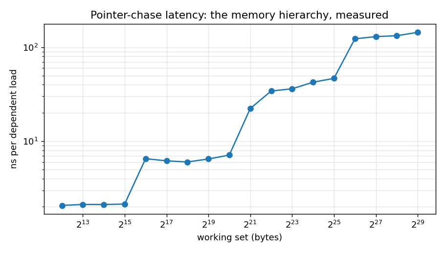

# memlayout-bench

[](https://github.com/rtgammaTest/memlayout-bench/actions/workflows/ci.yml)

**Where options-analytics code actually loses time: the memory hierarchy, measured.**

Most "slow Python/C++" in market-data systems isn't slow arithmetic. It's the CPU waiting on memory because the data layout makes it fetch 64-byte cache lines that are mostly bytes it doesn't need. This repo measures that directly on an options-chain workload.

## Headline

On a 104-byte-per-contract options chain (quotes + Greeks + position, 8M contracts):

| Query | AoS ns/row | SoA ns/row | SoA speedup |
|---|---|---|---|
| Net delta (2 of 16 fields) | 5.64 | 1.14 | **5.0x** |
| Wide risk row (13 of 16 fields) | 6.60 | 4.71 | 1.4x |
| NumPy: structured array vs contiguous arrays | 9.44 | 2.29 | 4.1x |

Same arithmetic, same data, same compiler. The only variable is layout. The speedup scales with the fraction of each cache line the query throws away: the narrow query uses 12 of every 104 bytes it drags in, the wide query uses most of them.

Reference run: Intel Core i7-8700 @ 3.20 GHz (6 cores / 12 threads, 32 KiB L1d, 256 KiB L2, 12 MiB L3), Ubuntu under WSL2, g++ 13 -O3 -march=native.

 Rerun on your own machine with `python run.py`; `results/RESULTS.md` is regenerated.*

## The three experiments

**1. Latency staircase (`./bench latency`).** A dependent pointer chase through a random single cycle of cache-line-sized nodes defeats the prefetcher, so each load pays the full latency of whichever level holds the working set:



| Working set | ns per load |
|---|---|
| 4 KiB | 1.5 |
| 8 KiB | 1.5 |
| 16 KiB | 1.6 |
| 32 KiB | 1.6 |
| 64 KiB | 4.3 |
| 128 KiB | 4.3 |
| 256 KiB | 5.7 |
| 512 KiB | 9.4 |
| 1 MiB | 11.4 |
| 2 MiB | 11.5 |
| 4 MiB | 14.7 |
| 8 MiB | 64.3 |
| 16 MiB | 82.9 |
| 32 MiB | 90.3 |
| 64 MiB | 95.8 |
| 128 MiB | 103.7 |
| 256 MiB | 109.8 |
| 512 MiB | 124.5 |

The plateaus align with this CPU's documented hierarchy: L1d ends at 32 KiB, L2 at 256 KiB, and the jump from 14.7 ns to 64.3 ns between 4 and 8 MiB is the 12 MiB shared L3 exhausting under a random access pattern.

A full SPX chain snapshot (~28.5K contracts at 40–104 bytes each) is 1–3 MB — L2/L3 territory. A session of quotes (~15 GB) is two orders of magnitude past any cache. That gap decides most design choices in a capture-and-analytics pipeline: what stays resident, what gets streamed, and what layout it's streamed in.

**2. You pay per cache line, not per element (`./bench stride`).** Summing every k-th int64 of a 512 MiB array: through stride 8 (one element per 64-byte line) the cost per *line* stays roughly flat, because the line is the unit of transfer. Beyond that, prefetch efficiency and TLB reach degrade and each line costs more.

## Cost per cache line by stride (int64 elements)

| Stride | ns per cache line |
|---|---|
| 1 | 3.42 |
| 2 | 3.23 |
| 4 | 3.36 |
| 8 | 3.48 |
| 16 | 5.14 |
| 32 | 7.17 |
| 64 | 7.62 |

**3. Layout (`./bench layout`, `bench_numpy.py`).** The AoS vs SoA comparison above. In NumPy, a structured array *is* an array-of-structs: `arr["delta"]` is a strided view, so the penalty shows up in Python code too, not just C++.

## Getting cache-miss counts (Linux)

The timings are the result; hardware counters are the explanation. With `perf` installed:

```bash
g++ -O3 -march=native -std=c++17 -o bench src/bench.cpp
perf stat -e cycles,instructions,cache-references,cache-misses,L1-dcache-load-misses,LLC-load-misses ./bench layout
```

Expect the AoS narrow query to show roughly an order of magnitude more LLC misses per row than SoA. On macOS, use Instruments' *Counters* template.

## Run it

```bash
python run.py           # full suite, ~1 minute, ~2 GB RAM
python run.py --quick   # smaller sizes, used by CI
```

Requirements: g++ (C++17), Python 3.10+, NumPy, matplotlib (optional, for the plot).

## Why this repo exists

At Qualcomm I led verification of a memory controller block — the hardware on the far side of every one of these loads. Bandwidth, latency, arbitration and contention were the day job. Moving to trading infrastructure, the same model turned out to predict where software was slow better than any profiler summary did. This is that model, made measurable.

MIT licensed.
